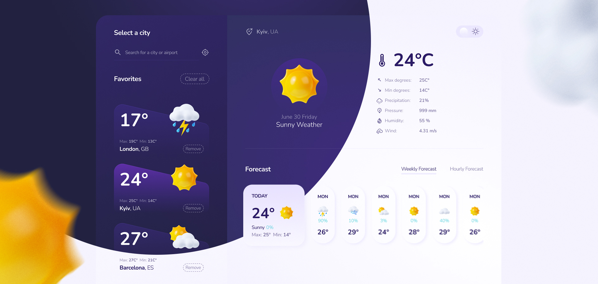

# Weather Forecast App
The **Weather Forecast** app allows users to get the weather forecast for their favorite cities, including both weekly and hourly forecasts. It also utilizes geolocation to automatically display the weather for the user's current location and supports easy customization.
## Live Demo
:green_circle:[**Live Demo**]()

## About Project
#### Technologies Used
- React, Redux Toolkit, Redux Persist | LocalStorage
- TypeScript, JavaScript
- SCSS and CSS modules
- React Swiper, React Icons
#### Features
- **Current** weather forecast
- **Weekly** and **Hourly** weather forecasts
- **Favorite** cities management
- **City** & **Location** Finder
- **Dark** and **Light** color scheme
#### APIs Used
- Weather API for weather data
- Geocoding API for current location, geographic names and coordinates.

## Getting Started
1. Clone the repository
2. Install dependencies `npm install`
3. Obtain API keys for Weather and Geocoding APIs
   - Visit the [OpenWeatherMap](https://openweathermap.org/api) website and sign up to obtain an API key
4. Set up environment variables
   - Create a `.env` file in the project root.
   - Add the following environment variables to the `.env` file:
   ```
     REACT_APP_LOCATION_API_KEY=your_api_key
     REACT_APP_WEATHER_API_KEY=your_api_key
     ```
   - Replace `your_api_key` with your actual API keys.
5. Start the development server `npm start`
6. Open the app in your browser `http://localhost:3000`

#### Contributing
Contributions to the Weather Forecast App are welcome! If you find any issues or have suggestions for improvements, feel free to open a new issue or submit a pull request.
#### License
This project is licensed under the MIT License. Feel free to use, modify, and distribute the code for personal and commercial purposes.

## Credits:
- [OpenWeatherMap](https://openweathermap.org/api) (Weather data & Geocoding APIs)
- Designed by [Oleksandr Antonenko](https://dribbble.com/antonenko_dev) :ukraine:


